# 📦 Sistema de Controle de Vendas e Estoque

Este projeto é uma aplicação **Single Page Application (SPA)** desenvolvida com **Laravel 10.10**, **Vue.js**, criada para a disciplina de **Programação Web**. Essa é uma aplicação de gerenciamento de vendas e estoque de produtos, com autenticação e controle de permissões de usuários.

## ⚙️ Requisitos

- PHP >= 8.1
- Composer
- Node.js e NPM
- Laravel >= 10.10
- Vue.js 3
- MySQL ou PostgreSQL

## 🏗️ Estrutura e Tecnologias

O sistema foi desenvolvido com base na arquitetura **MVC com Repository Pattern**, promovendo separação de responsabilidades e facilitando a manutenção do código.

- **Laravel Breeze**: Implementa autenticação com Vue e Inertia  
- **Vue.js**: Interface interativa e reativa  
- **Inertia.js**: Integração entre Laravel e Vue sem uso de APIs REST  
- **Autenticação com controle de permissões**`  

## 🧩 Entidades do Sistema

- **Cliente**  
- **Endereço**  
- **Fornecedor**  
- **Produto**  
- **Funcionário**  
- **Venda**  
- **User** (usuários do sistema)  
- **Role** (perfis de permissão)  

## 🖼️ Imagens do Sistema

### 🔹 Dashboard (Dashboard)
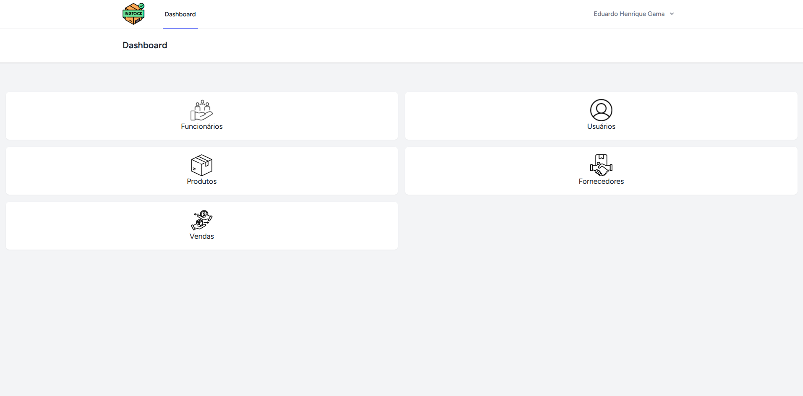

### 🔹 Tela Inicial da Aplicação
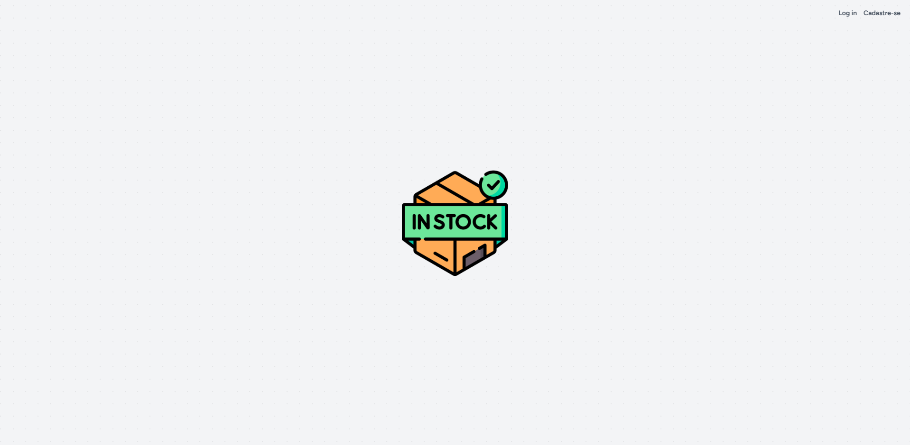

### 🔹 Tela Login 
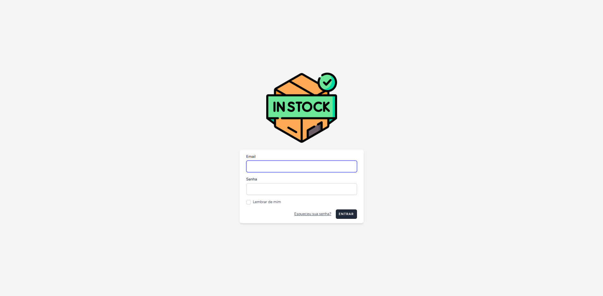

### 🔹 Tela Registro 
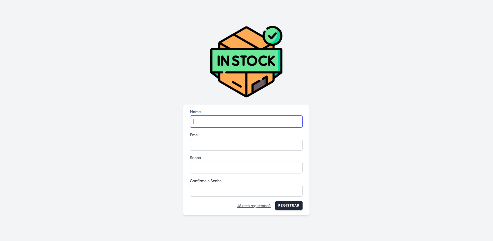

### 🔹 Tela de Funcionários
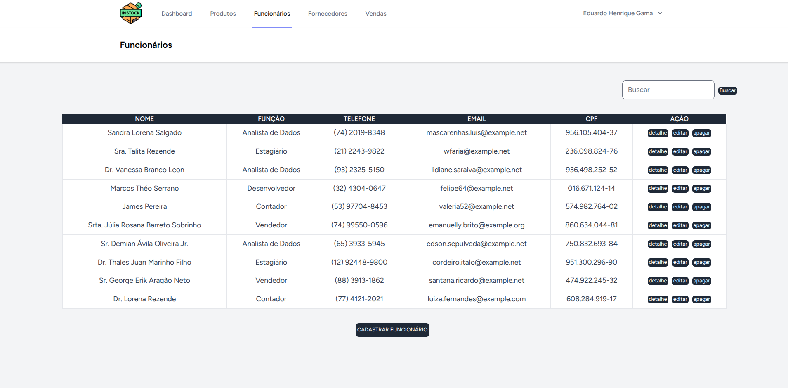

#### Cadastro de Funcionário
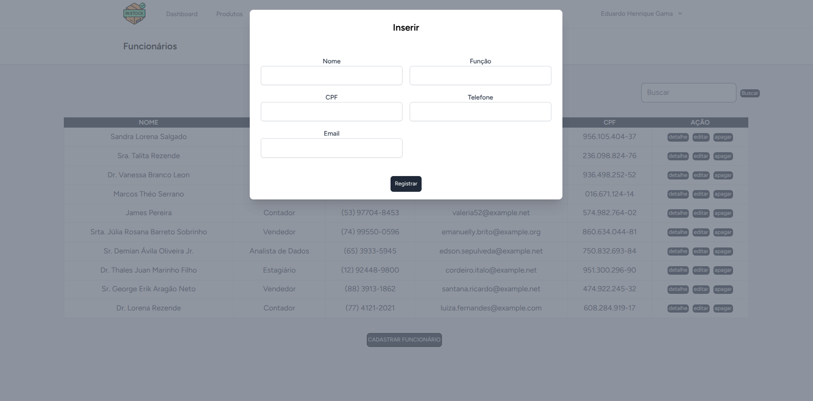

#### Edição do Funcionário


#### Detalhes do Funcionário
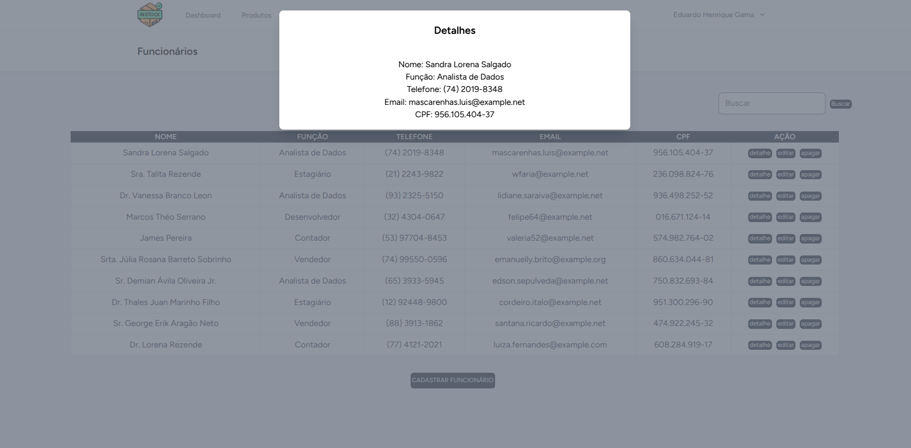

### 🔹 Tela de Fornecedores
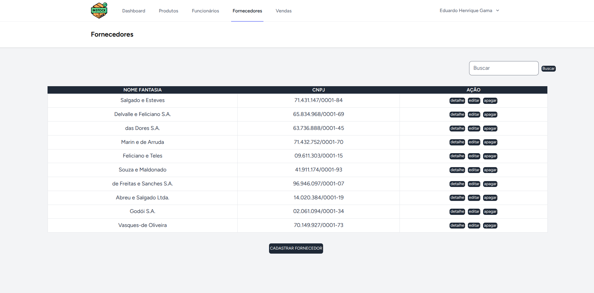

#### Cadastro de Fornecedor
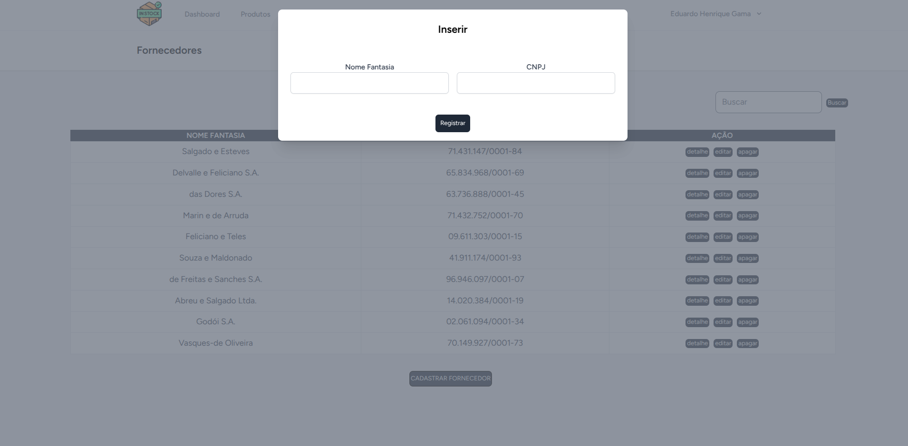

#### Edição do Fornecedor
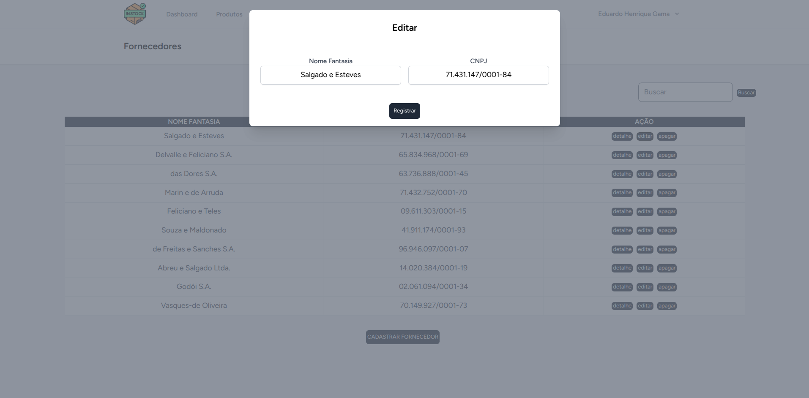

#### Detalhes do Fornecedor
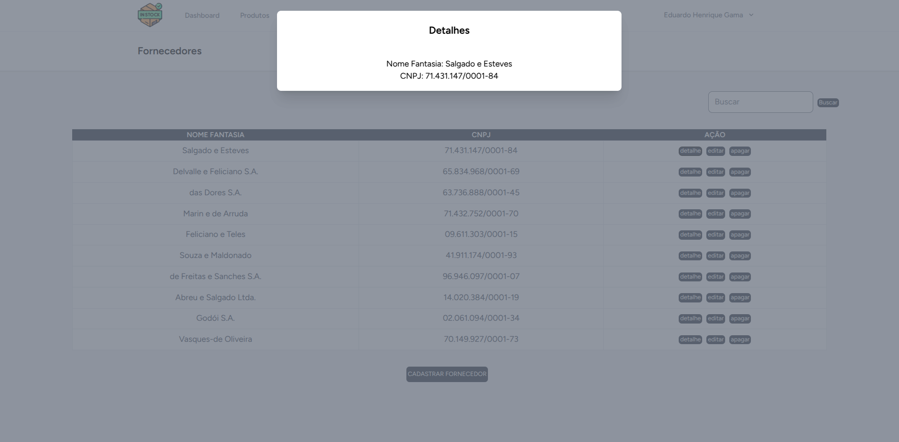

### 🔹 Tela de Produtos
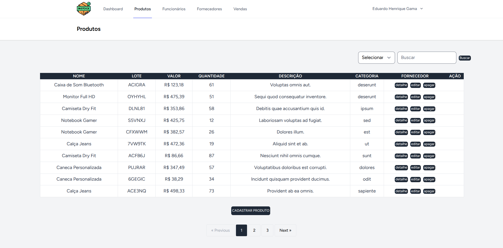

#### Cadastro de Produtos
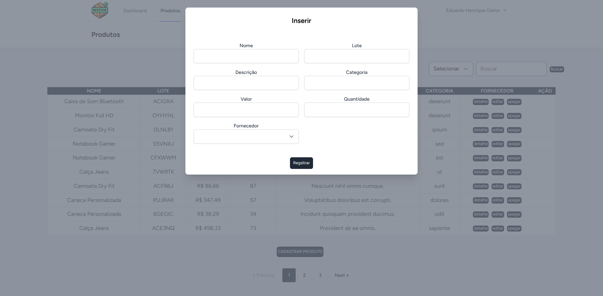

#### Edição de Produtos


#### Detalhes de Produtos
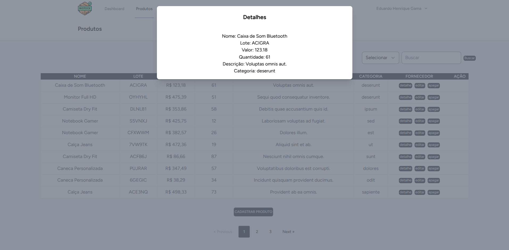

### 🔹 Tela de Vendas
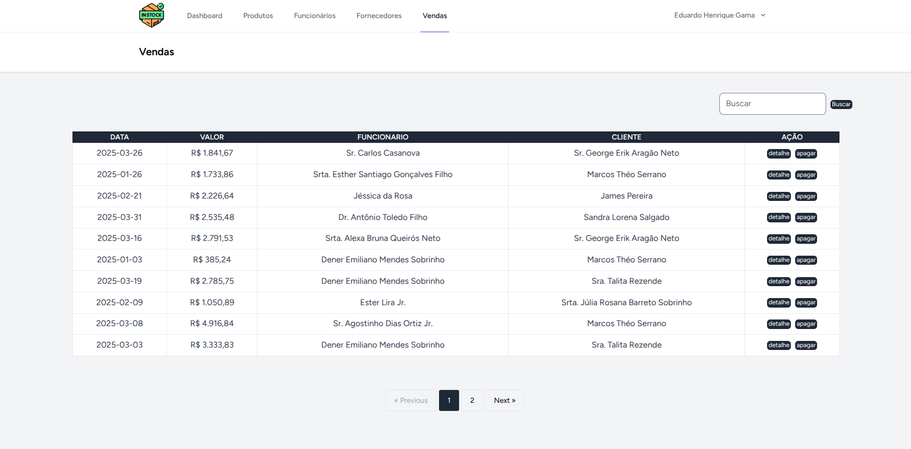

#### Detalhe das Vendas
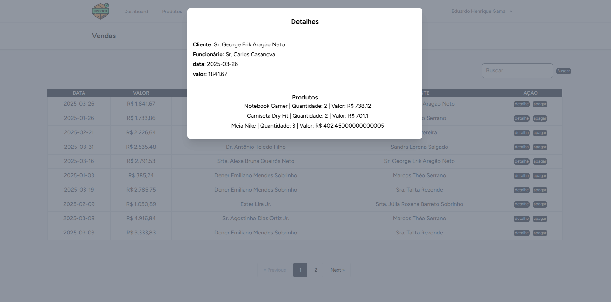

### 🔹 Funcionalidades Extras

#### Filtro de Registros

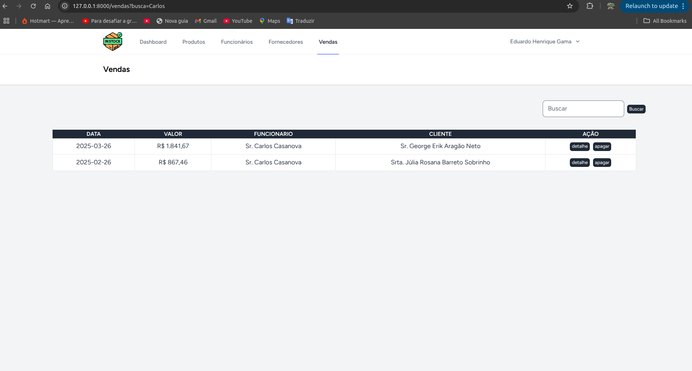

#### Exclusão de Registros

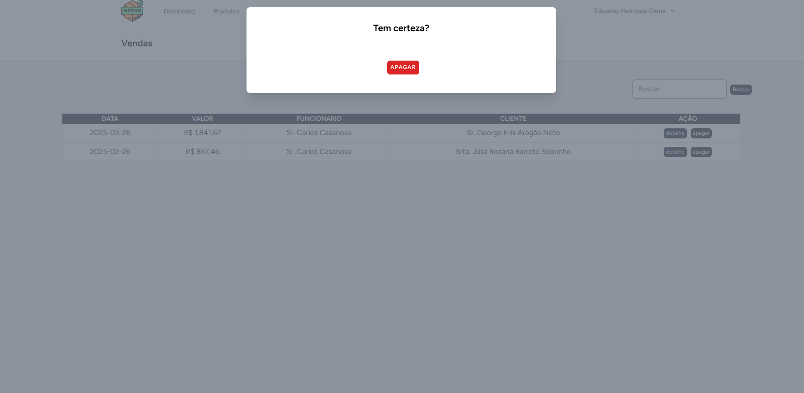

#### Tela de Edição de Perfil

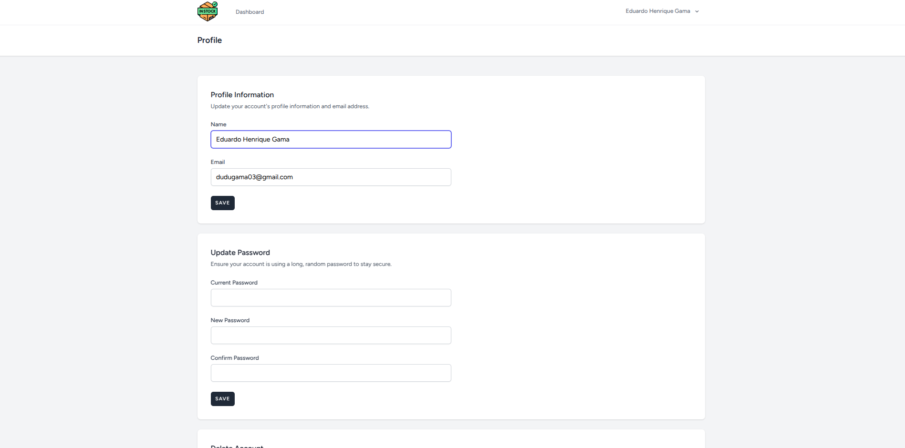

## 🔐 Autenticação e Permissões

A autenticação é feita via Laravel Breeze com Vue + Inertia.

## 🚀 Como rodar o projeto

- Depois de clonar o repositório certifique-se de criar e configurar o arquivo .env para conectar com o banco.

```bash
# Clonar o repositório
git clone https://github.com/DuduHenriqueMg/seu-projeto.git
cd seu-projeto

# Instalar as dependências PHP
composer install

# Instalar as dependências do Node
npm install

# Copiar o arquivo de .env.exemaple e configurar o .env
cp .env.example .env
php artisan key:generate

# Rodar as migrations e o DatabaseSeeder
php artisan migrate --seed

# Rodar o ambiente JS
npm run dev

# Rodar o projetto
php artisan serve
